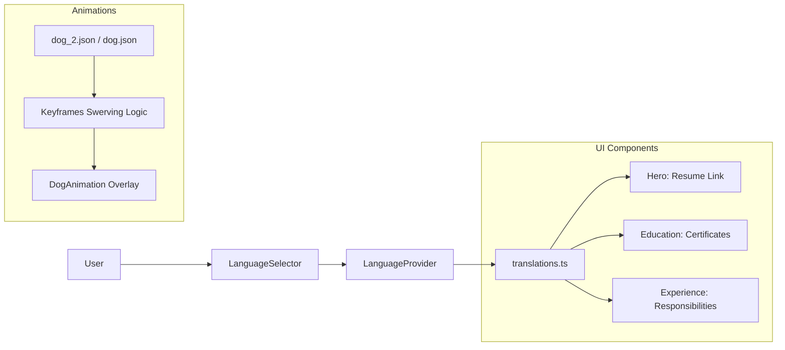

# 🐾 Project Management — Veterinary Portfolio

This document outlines the architectural standards, linguistic conventions, and animation logic implemented in this workspace.

## 🏗 Component Architecture

### 1. Education Section Redesign (May 2026)
- **Grid Strategy:** Two-column desktop layout to prevent white space.
- **Data Fetching:** Links are pulled from `translations.ts` and rendered as interactive cards.
- **Grouping:** All certificates must be categorized as either `congress` or `courses` to maintain visual consistency.

### 2. Dog Animation Overlay
- **Tech:** `lottie-react` + Global CSS Keyframes.
- **Z-Index:** Set to `50` to overlay content without blocking interactions (`pointer-events-none`).
- **Optimization:** Opacity and scale variations used to simulate 3D depth and prevent visual collisions.

## 🌐 Linguistic & Technical Standards

### Professional Tone (US 2026 Standards)
- **Hierarchy:** Prefer specific veterinary terminology over general terms (e.g., *Clinical Pathology* over *Clinical Lab*).
- **Localization Rules:**
    - **PT-BR:** Technical, formal, native.
    - **EN-US:** Academic authority, active verb usage (*Rescued*, *Managed*).
    - **Spanish:** Pure neutral professional, strict exclusion of PT-interference.

### Terminological Consistency
| Sector | PT-BR | EN-US | ES (Neutral) |
| :--- | :--- | :--- | :--- |
| Public Health | Saúde Pública | Public Health | Salud Pública |
| Inspection | Inspeção Sanitária | Sanitary Inspection | Inspección Sanitaria |
| Welfare | Bem-Estar Animal | Animal Welfare | Bienestar Animal |

## 📐 Data Flow Diagram

## 📝 Commit Standards
- **feat:** For new features (e.g., new animation logic, layout changes).
- **refactor:** For code optimization or linguistic adjustments.
- **style:** For purely visual/CSS tweaks.
- **docs:** For updates to this file or README.
