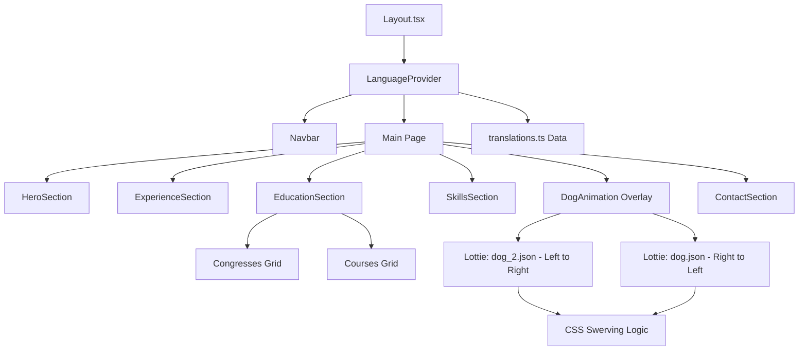

# Professional Portfolio — Vitor Casagrande

This is the professional portfolio of Vitor Casagrande, a Veterinary Medicine student focused on public health, sanitary inspection, and animal welfare. The project was built using modern web technologies to ensure high performance, technical authority, and international accessibility.

## Multilingual Support (US 2026 Standards)

The portfolio is fully localized for professional and academic contexts in:
- Portuguese (PT-BR): Native technical terminology.
- English (EN-US): Optimized for academic authority (e.g., Clinical Pathology, Veterinary Student).
- Spanish (Neutro): Native-level refinement, free from Portuguese interference.

## Tech Stack

- Framework: Next.js 16 (App Router & Turbopack)
- Styling: Tailwind CSS v4
- Components: Shadcn UI (Radix UI)
- Internationalization: Custom i18n system using React Context
- Animations: Lottie (via lottie-react) and CSS Keyframes
- Icons: Lucide React
- Deployment: Vercel

## Key Features

- Interactive Education Section: Reorganized layout grouping Congresses and Courses, with direct links to certificates hosted on Google Drive.
- Dynamic Lottie Companion: Smooth, realistic infinite animation of dogs running with swerving logic and depth perception.
- Career Timeline: Professional experience with highlighted metrics and refined technical responsibilities.
- Direct Resume Download: Optimized link to a cloud-hosted PDF for instant access.
- PWA & SEO Ready: Dynamic metadata and mobile-first experience.

## System Architecture



## Animation Logic

The DogAnimation component implements a non-colliding crossing system:
- Dog A (dog_2): Moves Left → Right. Swerves "up" (background) at 50% width, scales down to 0.9x.
- Dog B (dog): Moves Right → Left. Swerves "down" (foreground) at 50% width, scales up to 1.05x.
- Physics: Linear timing with different durations (14s vs 17s) to create varied meeting points.

## Local Setup

1. Install dependencies:
   ```bash
   npm install
   ```

2. Start development server:
   ```bash
   npm run dev
   ```

---
Developed by [Isllan Toso](https://www.linkedin.com/in/isllantoso/)
